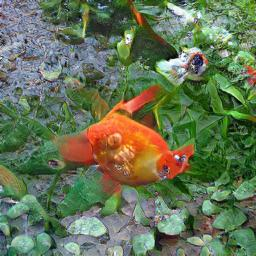

# biggan-256 图片素材

由神经网络 biggan-256 生成的图片

* 模型来源：[https://tfhub.dev/deepmind/biggan-256/2](https://tfhub.dev/deepmind/biggan-256/2)
* 使用 tensorflow 2.3 运行
* 共 1000 类，每类生成 100 张图片，以 jpg 格式储存

网页版：[https://playmat365.github.io/biggan_256/](https://playmat365.github.io/biggan_256/)

# 预览

点击图片可查看该分类

 

